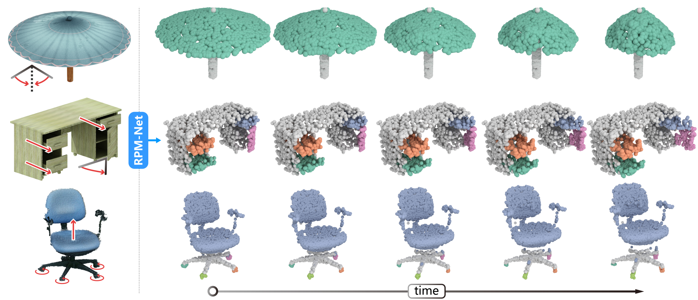

# RPM-Net
RPM-Net: Recurrent Prediction of Motion and Parts from Point Cloud




### Introduction

We introduce RPM-Net, a deep learning-based approach which simultaneously infers movable parts and hallucinates their motions from a single, un-segmented, and possibly partial, 3D point cloud shape. 
RPM-Net is a novel Recurrent Neural Network (RNN), composed of an encoder-decoder pair with interleaved Long Short-Term Memory (LSTM) components, which together predict a temporal sequence ofpointwise displacements for the input point cloud. At the same time, the displacements allow the network to learn movable parts, resulting in a motion-based shape segmentation.

For more details, please refer to our [paper](http://vcc.szu.edu.cn/file/upload_file//image/research/att201911071109/RPM-Net_reduced.pdf).


### Usage

All codes are tested under Tensorflow 1.13.1 GPU version and Python 3.6 on Ubuntu 14.04.

First, please download **data.zip** from our [project page](https://vcc.tech/research/2019/RPMNet), and extract to `RPM-Net/data/` folder.

Run **train.py** to train RPM-Net, the model will be saved in `RPM-Net/output/` folder.

Before testing, please modify the **model_path** and **eval_dir** in **test.py**, the predicted pointcloud and segmentation files will be saved in `RPM-Net/output/YOUR_MODEL_PATH/eval/` folder.

### Dataset
The original dataset is also released [here](http://vcc.szu.edu.cn/file/upload_file//image/research/att201911032109/mesh_obj.zip). See readme file inside for details.

### License
Our code is released under MIT License. See LICENSE file for details.

### Citation

Please cite the paper in your publications if it helps your research:
```
@article{RPMNet19,
title = {RPM-Net: Recurrent Prediction of Motion and Parts from Point Cloud},
author = {Zihao Yan and Ruizhen Hu and Xingguang Yan and Luanmin Chen and Oliver van Kaick and Hao Zhang and Hui Huang},
journal = {ACM Transactions on Graphics (Proceedings of SIGGRAPH ASIA 2019)},
volume = {38},
number = {6},
pages = {240:1--240:15},  
year = {2019},
} 
```
